**English** · **Русский** – every section is in both languages / каждый раздел на двух языках

## 👋 About · Обо мне

| 🇬🇧 English | 🇷🇺 Русский |
| - | - |
| I set up amoCRM for businesses end to end: I talk to the client, write the spec, build pipelines and automations, connect telephony, messengers and analytics, then hand the system over and keep it on support.  I lead a team of two integrators. Before that, project manager at an amoCRM integration company. Currently doing a master's degree. | Внедряю amoCRM под ключ: общаюсь с клиентом, пишу ТЗ, настраиваю воронки и автоматизацию, подключаю телефонию, мессенджеры и аналитику, сдаю проект и веду на поддержке.  Руковожу командой из двух интеграторов. До этого – проджект-менеджер в компании-интеграторе amoCRM. Сейчас учусь в магистратуре. |

## 🛠 Stack · Стек

|   |   |
| - | - |
| **CRM** |     |
| **Integrations · Интеграции** |       |
| **Analytics · Аналитика** |     |
| **Code & tools · Код и инструменты** |      |

## ⚙️ What I do · Что делаю

| 🇬🇧 English | 🇷🇺 Русский |
| - | - |
| Sales pipelines for B2B and B2C, with lead routing and automatic tasks | Воронки продаж для B2B и B2C с распределением заявок и автозадачами |
| Emails and website forms that turn into deals by themselves: parser, webhooks, MoreKIT | Письма и заявки с сайта сами превращаются в сделки: парсер, вебхуки, MoreKIT |
| Telephony and messengers inside the CRM: virtual PBX, Wazzup | Телефония и мессенджеры внутри CRM: виртуальная АТС, Wazzup |
| Marketing analytics: UTM tags, Roistat, call tracking | Маркетинговая аналитика: UTM-метки, Roistat, коллтрекинг |
| Contracts and invoices generated straight from the deal: F5 Documents, NeoDoc | Договоры и счета прямо из сделки: F5 Documents, NeoDoc |
| Salesbot scenarios and Digital Pipeline triggers | Сценарии Salesbot и триггеры Digital Pipeline |
| Reports in Google Sheets and Apps Script automation | Отчёты в Google Sheets и автоматизация на Apps Script |

## 📫 Contact · Связь

